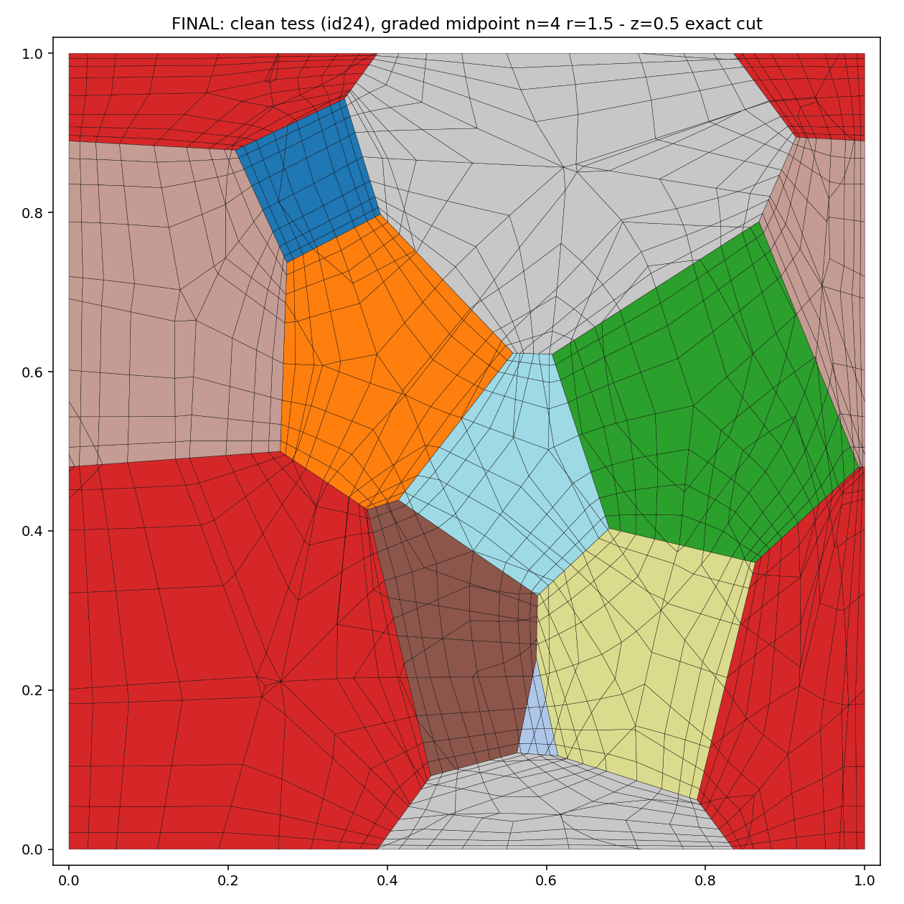

# PERHEX — periodic all-hex polycrystal RVEs with exactly planar grain boundaries

**Docs: <https://vivelakorea.github.io/PERHEX/>**

Generates representative volume elements (RVEs) for CPFEM that satisfy, **simultaneously and exactly**:

1. all-hexahedral (`C3D8R`) mesh — no tet subdivision, no forced 4x element count
2. grain boundaries lying **exactly on the tessellation planes** (no staircase, no smoothing approximation)
3. flat cubic domain with **node-to-node periodic matching** on opposite faces/edges/corners (machine precision), ready for periodic boundary conditions via `*EQUATION`
4. mesh **graded toward grain boundaries** (geometric layer ratio), with free choice of resolution

The construction: every vertex of a (generic) Laguerre cell touches exactly
3 cell edges and 3 cell faces, so each cell splits into **one hexahedron per
vertex** — corners (vertex, 3 edge midpoints, 3 face centroids, cell
centroid). Grain-boundary faces are covered by quads whose four corners all
lie in the face plane, so planarity is exact by construction. Each coarse hex
is then refined `n^3` with a geometrically graded schedule that is identical
for all hexes, which preserves conformity and periodicity while refining
toward the boundaries (all three local zero-planes of a corner hex lie on
cell faces).

Periodicity is obtained by re-tessellating the periodic seed set (plus its
27 images) on the unit cube, so opposite boundary traces are exact
translates; a cut-position optimizer keeps the cube planes away from
tessellation vertices.

## Pipeline

```bash
# 1. periodic tessellations (Neper >= 4), screened for minimum feature size
bash pick_tess.sh                 # candidates cand_*.tess
python eval_tess.py               # rank by min edge; copy the best to rve.tess

# 2. cut + midpoint hexes + graded refinement  (n=4, ratio=1.5)
python -c "from build_cube_rve import make_cut_tess; make_cut_tess()"
python gen_midpoint_hex.py 4 1.5  # -> mp_coords.npy / mp_conn.npy / mp_pid.npy

# 3. self-contained Abaqus deck for OXFORD-UMAT
python gen_mp_deck_oxford.py      # -> oxford_mp/rve_oxford.inp
```

Run with the open-source [OXFORD-UMAT](https://github.com/TarletonGroup/CrystalPlasticity) crystal
plasticity subroutine (not redistributed here):

```
abaqus job=rve_oxford input=rve_oxford.inp user=OXFORD-UMAT.f cpus=8 double=both
```

## Verification (20-grain example, n=4, r=1.5, 49,920 elements)

- element volumes sum to the domain volume to 1e-9 (exact tiling)
- all 8 Gauss-point Jacobians positive in every element
- opposite-face node sets match 100 % with in-plane offsets < 1e-12
- CPFEM 10 % uniaxial tension runs with periodic displacement jumps
  constant across every face pair



## Microstructure control

Everything about the microstructure is set at the Neper call in
`pick_tess.sh` and flows through the pipeline unchanged:

- **grain count**: `neper -T -n <N> ...`
- **grain size / shape distribution**: the `-morpho` argument. The default
  `gg` is a lognormal equivalent-diameter distribution
  (`diameq:lognormal(1,0.35)`); any Neper morphology spec works, e.g.
  `-morpho "diameq:lognormal(1,0.6),1-sphericity:lognormal(0.145,0.03)"`.
- **texture / ODF**: the `-ori` argument (`random`, `fiber(...)`, ODF
  sampling, or an explicit per-grain orientation file). Orientations are
  read back from the `*ori` section of the tessellation, so whatever
  Neper writes is what the Abaqus deck gets.
- **physical size**: the mesh is a unit cube; the physical edge length
  enters only through the d_b tables (`PERHEX_LPHYS` environment
  variable, default 25 um) and your material units.
- **mesh resolution / grading**: `gen_midpoint_hex.py <n> <ratio>`.

## Why planar (and node-matched) boundaries matter — measured

Same 20-grain microstructure, voxel N=40 vs this mesh:

| quantity (on-mesh GB) | voxel | this mesh |
|---|---|---|
| facet normal error vs true Laguerre plane | mean 45.2°, p90 70° | 0 |
| GB surface area | 1.497x inflated | exact |
| GB normal evolution under 10 % tension | undefined (wrong at t=0) | tracked (median rotation 4.4°, p90 15.9°) |

These corrupt any model input measured on the mesh geometry. Example:
the grain-boundary dislocation storage term of Haouala et al. (IJP 2020),
`rho_dot = (1/b) max(k1 sqrt(rho_f), K_s/d_b)`, needs the slip-direction
distance-to-boundary `d_b`. Marching rays through the staircase geometry
instead of the true planes corrupts `d_b` by a median 8.9 % (p90 64 %) at
voxel centers — and by a median 30 % (p90 138 %) at the GB-graded
element centroids where the term matters most (`gen_db_table*.py`).

## GB-distance study (R1–R4)

`oxford-patch/` adds the K_s/d_b term to OXFORD-UMAT (6 small patches +
one new file, `dbtrace.f`; `hardeningparam(7)=K_s`, zero = bit-identical
to upstream) and supports three d_b modes:

- frozen t=0 table (`db_table.dat`, literature practice)
- chord convection `d_b0 * |F.s0|` (`dbconvect=1`)
- **per-increment ray-tracing of the deformed facets** (`dbconvect=2`):
  the deck writes GB nodal displacements to the `.fil` every increment,
  `URDFIL` reads them, facet quads move with their actual nodes, and
  Möller–Trumbore against precomputed candidate lists (`gen_gb_rt.py`)
  re-measures every (element x slip system x sense) distance. The t=0
  trace reproduces the exact Laguerre distances to machine precision.
  Requires `mp_mode=threads`.

Runs: R1 midpoint+exact frozen / R2 midpoint+ray-traced live /
R3 midpoint+staircase frozen / R4 voxel+staircase frozen.
(Results section: pending completion of R2–R4; R1 = 10 % tension,
328 increments, explicit state update, flow stress 86.8 MPa.)

## Notes

- Tessellations must not contain features smaller than the target mesh
  size; `pick_tess.sh`/`eval_tess.py` screen random seeds for this
  (regularization is not available for periodic tessellations in Neper).
- Rendering cross-sections: cut element edges against the plane exactly;
  face-based approximations show spurious gaps.

## Requirements

Neper >= 4.10 (with gmsh 4.8.x on PATH), Python 3 + numpy, Abaqus for the
CPFEM step.
